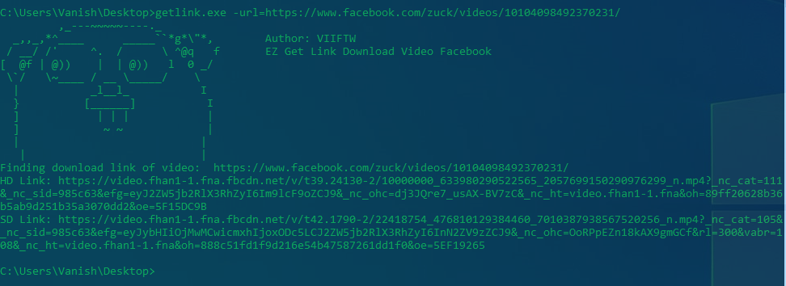

# getlink

getlink allows you to get link download from video facebook url (both HD and SD)

## Usage

Install the command line tool first. (or download a release)

```bash
go get github.com/viiftw/getlink
```

Example: Get link video [Mark Zuckerberg's keynote at Oculus Connect](https://www.facebook.com/zuck/videos/10104098492370231/)

```bash
getlink -url=https://www.facebook.com/zuck/videos/10104098492370231/
```


